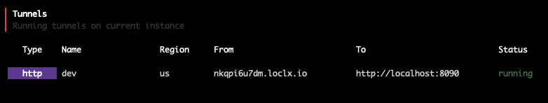

# Expose database server (PocketBase)

## What is PocketBase?

> [Open Source backend](https://pocketbase.io) for your next **SaaS** and **Mobile app** in **1 file**

> ... an [open source backend](https://pocketbase.io/docs/) consisting of embedded database (SQLite) with realtime subscriptions, built-in users management, convenient dashboard UI and simple REST-ish API.

Explore the [documentation](https://pocketbase.io/docs/) to see all the features and capabilities of PocketBase.

## 1. Download & install PocketBase

PocketBase is available on all platforms (`Linux`, `macOS`, `Windows`) and can be downloaded (11MB) via the [Github repository](https://github.com/pocketbase/pocketbase/releases).

example:
```bash
wget https://github.com/pocketbase/pocketbase/releases/download/v0.3.2/pocketbase_0.3.2_darwin_amd64.zip
unzip /path/to/pocketbase_0.3.2_darwin_amd64.zip -d /path/to/pocketbase
cd /path/to/pocketbase/
```

## 2. Start PocketBase service

```bash
./pocketbase serve
# > Server started at: http://localhost:8090
#   - REST API: http://localhost:8090/api/
#   - Admin UI: http://localhost:8090/_/
```

## 3. Create admin account


## 4. Create a collection with some records


## 5. API access

Grant access to `API` list action:


Confirm `API` access via `localhost`:

[http://localhost:8090/api/collections/posts/records](http://localhost:8090/api/collections/posts/records)

`JSON` result (example):

```json
{
	"page": 1,
	"perPage": 30,
	"totalItems": 2,
	"items": [{
		"@collectionId": "WvcPifBVEqtFagS",
		"@collectionName": "posts",
		"created": "2022-07-29 03:03:09.326",
		"id": "uh6ON17M1PQvM7b",
		"post": "lorem ipsum dolor ... bibendum ... donec suscipit.",
		"slug": "hello-world",
		"title": "Hello world",
		"updated": "2022-07-29 03:03:09.326"
	}, {
		"@collectionId": "WvcPifBVEqtFagS",
		"@collectionName": "posts",
		"created": "2022-07-29 03:03:55.468",
		"id": "lk4Zp5nvuStwRzJ",
		"post": "lorem ipsum dolor sit amet, consectetur adipiscing elit. morbi bibendum commodo congue. vivamus efficitur aliquam felis, id viverra eros blandit sit amet. nam feugiat purus ac sem aliquam, sit amet dictum dui bibendum. sed tincidunt porttitor odio at feugiat. cras sed viverra libero. suspendisse potenti. nulla eu ullamcorper quam, in tempus nulla. quisque accumsan euismod finibus.\r\n",
		"slug": "testing-1-2-3",
		"title": "Testing 1 2 3",
		"updated": "2022-07-29 03:04:02.263"
	}]
}
```

## 6. Install LocalXpose

LocalXpose is available on all platforms (`Linux`, `macOS`, `Windows`), a `docker` container, and can be downloaded (~12MB) via [localxpose.io](https://localxpose.io/#download), `snap` and `brew`.

example:

```bash
brew install localxpose
```

## 7. Create LocalXpose account

### a. Sign up

- [https://localxpose.io/?via=obsmd](https://localxpose.io/?via=obsmd) (← affiliate link)

### b. Login

Copy `access token`:


## 8. Login via loclx

Use `access token` to login:

```bash
loclx account login
# result
# ? please type your access token ****************************************
# logged in Successfully
```

## 9. Expose PocketBase port

### a. Create config.yml for loclx

```yaml
# config.yml
dev:
  type: http
  region: us
  to: localhost:8090
```

### b. Initiate loclx tunnel

```bash
loclx tunnel config --path /path/to/config.yml
```

## 11. Results



### a. Access API results 

Test `API` access via `loclx.io` sub-domain


### b. Access PocketBase admin

Test admin access via `loclx.io` sub-domain


## 12. Software Development Kit

Utilize the PocketBase Javascript `SDK` ([pocketbase/js-sdk](https://github.com/pocketbase/js-sdk)) to consume the `API`.

example `CRUD` code:


